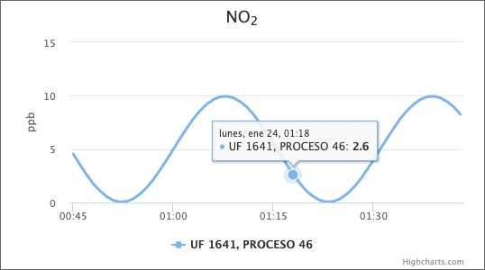

# SMA254Log

API para tabla de log para distribución SMA254.

## Instalación

Instalar paquete `airviro/sma254log`.

```sh
composer require airviro/sma254log
```

Agregar `SMA254LogServiceProvider` en la configuración de la aplicación `config/app.php`.

```php
'providers' => [
	…
	Airviro\SMA254Log\SMA254LogServiceProvider::class,
	…
]
```

Migrar la nueva tabla `SMA254LOG`.

```sh
php artisan migrate
```

Insertar registros en la tabla de logs mediante la distribución SMA254. _Requiere configurar una estación de distribución_. En el ejemplo existe la estación `ZZ0` ya configurada para registros cada minuto.

```sh
xprSMA254 /dev/null ZZ0 `date -d "25 minutes ago" +%y%m%d%H%M`
```

## Configuración

Opcionalmente puedes especificar la opción de paginación a la configuración de entorno `.env`.

```conf
SMA254LOG_PAGINATION=100
```

## Uso de la API para presentar los logs

El API proporciona acceso a solicitudes con método GET exclusivamente. El acceso a esta API no requiere autenticación para su usoEl formato de esta API cumple con la especificación [`JSON API`](https://jsonapi.org/).

- `/api/sma254log`
- `/api/sma254log/{id-verificación}`
- `/api/sma254log/{ufID}/{procesoID}`
- `/api/sma254log/{ufID}/{procesoID}/{dispositivoID}`
- `/api/sma254log/{ufID}/{procesoID}/{dispositivoID}/{parametroNombre}`
- `/api/sma254log/{ufID}/{procesoID}/{dispositivoID}/{parametroNombre}/{fromTimestamp}`
- `/api/sma254log/{ufID}/{procesoID}/{dispositivoID}/{parametroNombre}/{fromTimestamp}/{toTimestamp}`
- `/api/sma254log/{ufID}/{procesoID}/{dispositivoID}/{parametroNombre}/{fromTimestamp}/{toTimestamp}/highcharts`

La API retorna un JSON con los datos disponibles a través de la propiedad `data`. Los datos están paginados y pueden ser consultados utilizando las propiedades `links.next_page_url` y `links.prev_page_url`.

Los parámetros deben ser proporcionados mediante las siguientes especificaciones.

| parámetro  | tipo de dato  | comentario |
| :------------ |:--------------- |:----- |
| id-verificación | cadena de caracteres de longitud 36 | identificador emitido por SMA para validar el envío de un dato específico |
| ufID      | entero | identificador de la unidad fiscalizable según catastro |
| procesoID | entero | identificador de proceso según catastro |
| dispositivoID | entero | identificador de dispositivo según catastro |
| parametroNombre | cadena variable de caracteres | nombre de parámetro según catastro |
| fromTimestamp | entero | unixtime |
| toTimestamp | entero | unixtime |

## Uso de salida Highcharts

La API puede obtener datos de un parámetro específico para ser utilizado como serie de Highcharts.

```json
{
	"links": {
		"prev_page_url": "https://chart.lan/api/sma254log/1641/46/252/NOX/1644325200/1644354000/highcharts?cursor=eyJ1bml4dGltZSI6MTY0NDMzNjAwMCwiX3BvaW50c1RvTmV4dEl0ZW1zIjpmYWxzZX0",
		"next_page_url": "https://chart.lan/api/sma254log/1641/46/252/NOX/1644325200/1644354000/highcharts?cursor=eyJ1bml4dGltZSI6MTY0NDM0NjgwMCwiX3BvaW50c1RvTmV4dEl0ZW1zIjp0cnVlfQ",
		"self": "https://chart.lan/api/sma254log/1641/46/252/NOX/1644325200/1644354000/highcharts?cursor=eyJ1bml4dGltZSI6MTY0NDMzMjQwMCwiX3BvaW50c1RvTmV4dEl0ZW1zIjp0cnVlfQ"
	},
	"data": [
		{
			"x": 1644336000000,
			"y": 0.1,
			"id": "c4d5ec56-1668-47fc-9d86-daedd84fe4f7",
			"unidad": "ppb",
			"enviado": 1644342903000
		},
		{
			"x": 1644339600000,
			"y": 1.3,
			"id": "a554703d-8c7f-42ad-b2f1-6e238e104f51",
			"unidad": "ppb",
			"enviado": 1644342905000
		},
		{
			"x": 1644346800000,
			"y": 6.45,
			"id": "de2da39b-a687-494d-ad38-c2c4435b0743",
			"unidad": "ppb",
			"enviado": 1644353703000
		}
	]
}
```

Ejemplos de salidas generadas en [Highcharts](https://www.highcharts.com/) mediante el uso de esta API.




