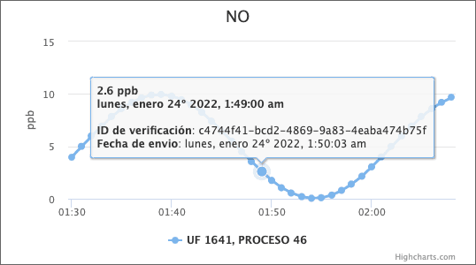

# SMA254Log

API para tabla de log para distribución SMA254.

## Instalación

Instalar paquete `airviro/sma254log`.

```sh
composer require airviro/sma254log
```

Agregar `SMA254LogServiceProvider` en la configuración de la aplicación `config/app.php`.

```php
'providers' => [
	…
	Airviro\SMA254Log\SMA254LogServiceProvider::class,
	…
]
```

Migrar la nueva tabla `SMA254LOG`.

```sh
php artisan migrate
```

Insertar registros en la tabla de logs mediante la distribución SMA254. _Requiere configurar una estación de distribución_. En el ejemplo existe la estación `ZZ0` ya configurada para registros cada minuto.

```sh
xprSMA254 /dev/null ZZ0 `date -d "25 minutes ago" +%y%m%d%H%M`
```

## Configuración

Opcionalmente puedes especificar la opción de paginación a la configuración de entorno `.env`.

```conf
SMA254LOG_PAGINATION=100
```

## Uso de la API para presentar los logs

El API proporciona acceso a solicitudes con método GET exclusivamente. El acceso a esta API no requiere autenticación para su uso.

- `/api/sma254log`
- `/api/sma254log/{id-verificación}`
- `/api/sma254log/{ufID}/{procesoID}`
- `/api/sma254log/{ufID}/{procesoID}/{dispositivoID}`
- `/api/sma254log/{ufID}/{procesoID}/{dispositivoID}/{parametroNombre}`
- `/api/sma254log/{ufID}/{procesoID}/{dispositivoID}/{parametroNombre}/{fromTimestamp}`
- `/api/sma254log/{ufID}/{procesoID}/{dispositivoID}/{parametroNombre}/{fromTimestamp}/{toTimestamp}`
- `/api/sma254log/{ufID}/{procesoID}/{dispositivoID}/{parametroNombre}/{fromTimestamp}/{toTimestamp}/highcharts`

La API retorna un JSON con los datos disponibles a través de la propiedad `data`. Los datos están paginados y pueden ser consultados utilizando las propiedades `next_page_url` y `prev_page_url`.

Los parámetros deben ser proporcionados mediante las siguientes especificaciones.

| parámetro  | tipo de dato  | comentario |
| :------------ |:--------------- |:----- |
| id-verificación | cadena de caracteres de longitud 36 | identificador emitido por SMA para validar el envío de un dato específico |
| ufID      | entero | identificador de la unidad fiscalizable según catastro |
| procesoID | entero | identificador de proceso según catastro |
| dispositivoID | entero | identificador de dispositivo según catastro |
| parametroNombre | cadena variable de caracteres | nombre de parámetro según catastro |
| fromTimestamp | entero | unixtime |
| toTimestamp | entero | unixtime |

## Uso de salida Highcharts

La API puede obtener datos de un parámetro específico para ser utilizado como serie de Highcharts.

```json
{
	"data": [
		{
			"x": 1642996200000,
			"y": 0.55,
			"id": "d125c9e8-5711-438f-bd7b-d93441a37cb2",
			"unidad": "ppb",
			"enviado": 1642997411000
		},
		{
			"x": 1642996260000,
			"y": 0.2,
			"id": "d5fa9d4e-dbb6-4258-af70-234dbf11da77",
			"unidad": "ppb",
			"enviado": 1642997413000
		},
		{
			"x": 1642996320000,
			"y": 0.05,
			"id": "0d005b28-728c-47d8-8476-ea16d9edfc3d",
			"unidad": "ppb",
			"enviado": 1642997414000
		},
		{
			"x": 1642996380000,
			"y": 0.1,
			"id": "d7be5352-c6b0-449c-978b-bfc3ef9d7de1",
			"unidad": "ppb",
			"enviado": 1642997416000
		},
		{
			"x": 1642996440000,
			"y": 0.35,
			"id": "7d23704a-6d9f-4c8e-a1bf-680ebfa8417e",
			"unidad": "ppb",
			"enviado": 1642997418000
		}
	],
	"prev_page_url": "https:\/\/airviro.r9.cl\/api\/sma254log\/1641\/46\/252\/NO2\/1642995900\/1642999380\/highcharts?cursor=eyJ1bml4dGltZSI6MTY0Mjk5NjIwMCwiX3BvaW50c1RvTmV4dEl0ZW1zIjpmYWxzZX0",
	"next_page_url": "https:\/\/airviro.r9.cl\/api\/sma254log\/1641\/46\/252\/NO2\/1642995900\/1642999380\/highcharts?cursor=eyJ1bml4dGltZSI6MTY0Mjk5NjQ0MCwiX3BvaW50c1RvTmV4dEl0ZW1zIjp0cnVlfQ"
}
```




